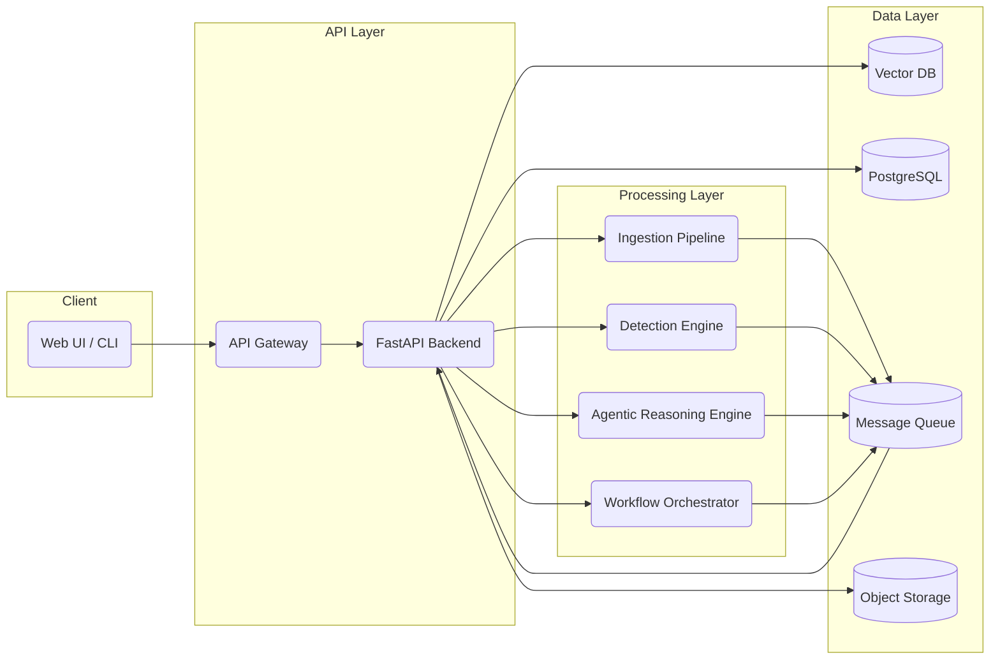
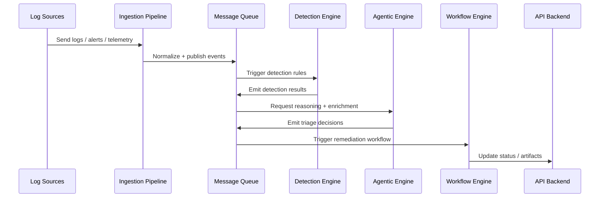

# 🔐 Secure Agentic CloudOps SIEM Platform

A cloud-native, event-driven **SIEM-style security and CloudOps platform** that demonstrates **log ingestion, streaming pipelines, detection engineering, and scalable backend system design**.

This project simulates how modern security platforms ingest logs, process them in real time, detect suspicious activity, and persist alerts for investigation — while also outlining a clear roadmap toward **agentic, LLM-powered security automation**.

---

## 📛 Badges

<p align="left">
  
  
  
</p>

<!-- **Note:** CI/CD, Tests, SAST, secrets scanning, and docs badges will be added once implemented. -->

---

## 🎯 Project Objectives

- **Ingest logs:** Accept raw security logs through a REST API.
- **Stream events:** Stream logs using Kafka-compatible infrastructure (Redpanda).
- **Detect in real time:** Apply detection logic and scoring as events flow through the system.
- **Persist signals:** Store normalized events and alerts in PostgreSQL for investigation.
- **Support investigation:** Enable query-driven validation and basic investigation workflows.
- **Show system design:** Demonstrate production-grade, decoupled microservice architecture.
- **Enable a roadmap:** Provide a clear path to agentic security automation.

---

## 🚧 Implementation Status

This repository intentionally includes **both implemented components and a forward-looking architecture**.

### ✅ Implemented (fully working)

- **Ingest service:** FastAPI-based log ingestion.
- **Streaming:** Kafka-compatible event streaming using Redpanda.
- **Detection:** Detection service consuming Kafka events.
- **Persistence:** PostgreSQL persistence for events and alerts.
- **Validation:** End-to-end data flow validation.
- **One-command run:** Local execution via `scripts/run_all.sh`.
- **Infra:** Dockerized infrastructure.

### 🧭 Planned / roadmap

- **Agentic reasoning:** Agentic LLM reasoning engine.
- **Knowledge retrieval:** Vector knowledge base for contextual retrieval.
- **Automation:** Automated remediation workflows.
- **Gateway & auth:** API gateway with authentication (JWT/OAuth/RBAC).
- **UI:** SIEM dashboards and visualizations.
- **Cloud:** Cloud deployment (AWS / GCP).
- **Engineering:** CI/CD pipelines (tests, SAST, secrets scanning).

> ⚠️ **Scope note**  
> Advanced components described later in this README (agentic reasoning, vector retrieval, workflows, API gateway, cloud deployment)
> represent the **architectural roadmap and system design intent**.  
> The current implementation focuses on a production-grade ingestion, streaming, detection, and persistence pipeline.

---

## 🧭 Table of contents

- [High-level architecture current implementation](#-high-level-architecture-current-implementation)
- [Architecture explanation step-by-step](#-architecture-explanation-step-by-step)
- [Future-state architecture roadmap](#-future-state-architecture-roadmap)
- [Technology stack](#-technology-stack)
- [Ports and services](#-ports-and-services)
- [Repository structure](#-repository-structure)
- [Quick start one command](#-quick-start-one-command)
- [Verify after running](#-verify-after-running)
- [Stop and reset](#-stop-and-reset)
- [Service breakdown](#-service-breakdown)
- [Developer experience local development](#-developer-experience-local-development)
- [CI/CD workflows planned](#-cicd-workflows-planned)
- [Deployment current and planned](#-deployment-current-and-planned)
- [Production hardening planned](#-production-hardening-planned)
- [Observability planned](#-observability-planned)
- [Future enhancements](#-future-enhancements)
- [License](#-license)

---

## 🏗️ High-level architecture current implementation

```text
Client (curl / scripts / agents)
        |
        v
Ingest Service (FastAPI)
        |
        v
Kafka / Redpanda (topic: logs.raw)
        |
        v
Detection Service (Kafka Consumer)
        |
        v
PostgreSQL
   ├── events   (normalized logs)
   └── alerts   (scored detections)
```

---

## 🧠 Architecture explanation step-by-step

### 1️⃣ Client

- **Represents:** VPN gateways, authentication servers, firewalls, cloud services, apps.
- **Responsibility:** Send logs as JSON payloads over HTTP.

### 2️⃣ Ingest service (FastAPI)

- **Responsibilities:**
  - **Validate:** Validate incoming payload structure.
  - **Normalize:** Normalize logs into a consistent event model.
  - **Identify:** Assign a unique `event_id`.
  - **Publish:** Publish normalized events to Kafka topic `logs.raw`.
- **Why it matters:**
  - **Decoupling:** Producers are decoupled from consumers.
  - **Scale:** Ingest can scale independently.
  - **Resilience:** Kafka buffers spikes and protects downstream services.

### 3️⃣ Kafka / Redpanda

- **Responsibilities:**
  - **Backbone:** Event streaming backbone.
  - **Buffering:** Reliable buffering and replay.
  - **Distribution:** Fan-out to one or more consumers.

### 4️⃣ Detection service

- **Responsibilities:**
  - **Consume:** Consume from `logs.raw`.
  - **Score:** Apply detection rules / scoring.
  - **Persist:** Write alerts to PostgreSQL.
  - **Emit:** Optionally emit downstream topics (example: `alerts.scored`).

### 5️⃣ PostgreSQL

- **Responsibilities:**
  - **Store:** Store normalized events + derived alerts.
  - **Investigate:** Support investigation queries and historical analysis.
- **Tables:**
  - **events:** Normalized raw logs.
  - **alerts:** Scored detections / security signals.

## 🧭 Future-state architecture roadmap

This section is the **target architecture** for agentic, LLM-powered evolution.

### High-level system architecture vision


### Data flow overview vision

## 🔐 Technology stack

### Backend and streaming

- **Language:** Python 3.12
- **API framework:** FastAPI
- **Streaming:** Redpanda (Kafka-compatible)
- **Database:** PostgreSQL

### Tooling and infrastructure

- **Containers:** Docker, Docker Compose
- **Python env:** Poetry
- **Dev:** VS Code (recommended)

## 🔌 Ports and services

| Service | Description | Port | Access |
|---|---|---:|---|
| Ingest Service | Log ingestion API | 8001 | `http://127.0.0.1:8001` |
| Detection Service | Detection + Kafka consumer API | 8002 | `http://127.0.0.1:8002` |
| Redpanda (Kafka) | Streaming broker | 9092 | PLAINTEXT |
| Redpanda HTTP API | Broker admin | 8082 | `http://127.0.0.1:8082` |
| Redpanda Console | Kafka UI | 8080 | `http://127.0.0.1:8080` |
| PostgreSQL | Events & alerts DB | 5432 | `cloudops` database |
| MLflow | Experiment tracking | 5001 | `http://127.0.0.1:5001` |

## 📂 Repository structure

```text
secure-agentic-cloudops-siem-platform/
├── docker-compose.yml
├── README.md
├── LICENSE
├── .gitignore
├── services/
│   ├── ingest-service/
│   │   ├── app/
│   │   │   └── main.py
│   │   └── pyproject.toml
│   └── detection-service/
│       ├── app/
│       │   └── main.py
│       └── pyproject.toml
├── scripts/
│   ├── run_all.sh
│   ├── stop_all.sh
│   ├── reset_all.sh
│   └── seed_sample_events.py
└── docs/

```

## 🧩 Service Breakdown

Each major component is modular and independently deployable.  
Click to expand each section for details.

---

<details>
<summary><strong>🧩 Ingestion Pipeline</strong></summary>

**Purpose:**  
Handles log, alert, and telemetry ingestion from multiple sources.

**Modules:**  
- `parsers/` — Source‑specific parsers  
- `normalizers/` — Schema normalization  
- `enrichers/` — Metadata enrichment  
- `publishers/` — Event dispatch to message queue  

**Supported Sources:**  
- Cloud provider logs  
- Security alerts  
- Application telemetry  
- Custom connectors  

**Output:**  
Normalized events published to `Message Queue`

</details>

---

<details>
<summary><strong>🧠 Agentic Reasoning Engine</strong></summary>

**Purpose:**  
Uses LLMs to reason over events, enrich context, and generate triage decisions.

**Modules:**  
- `context_builder/` — Builds event context  
- `retriever/` — Vector DB retrieval  
- `llm_core/` — LLM reasoning logic  
- `policy_engine/` — Decision policies  
- `action_generator/` — Suggested actions  

**LLM Providers:**  
- OpenAI  
- Azure OpenAI  
- Anthropic  
- Local models (via Ollama)  

**Output:**  
Triage decisions and suggested actions published to `Message Queue`

</details>

---

<details>
<summary><strong>🔍 Detection Engine</strong></summary>

**Purpose:**  
Applies detection rules and correlation logic to incoming events.

**Modules:**  
- `rules/` — YAML‑based detection rules  
- `correlators/` — Multi‑event correlation  
- `matchers/` — Signature and anomaly matching  
- `emitters/` — Detection result publishing  

**Rule Packs:**  
- MITRE ATT&CK  
- Cloud misconfigurations  
- Custom rules  

**Output:**  
Detection results published to `Message Queue`

</details>

---

<details>
<summary><strong>📚 Vector Knowledge Layer</strong></summary>

**Purpose:**  
Stores embeddings of documentation, runbooks, and prior incidents for retrieval.

**Modules:**  
- `indexers/` — Embedding + ingestion  
- `retrievers/` — Query‑time retrieval  
- `chunkers/` — Text chunking strategies  
- `embedders/` — OpenAI / HuggingFace / Cohere  

**Sources:**  
- Markdown docs  
- PDFs  
- Incident timelines  
- External APIs  

**Output:**  
Contextual data for agentic reasoning

</details>

---

<details>
<summary><strong>⚙️ Workflow Orchestrator</strong></summary>

**Purpose:**  
Executes multi‑step remediation workflows triggered by agentic decisions.

**Modules:**  
- `triggers/` — Event‑based triggers  
- `steps/` — Declarative step definitions  
- `executors/` — Cloud API calls  
- `notifiers/` — Slack / Email / PagerDuty  

**Supported Actions:**  
- Quarantine instance  
- Rotate credentials  
- Block IP  
- Notify team  

**Output:**  
Remediation status updates

</details>

---

<details>
<summary><strong>🌐 API Gateway & Backend</strong></summary>

**Purpose:**  
Exposes REST API for orchestration, status, and integrations.

**Modules:**  
- `routes/` — FastAPI endpoints  
- `services/` — Business logic  
- `auth/` — JWT / OAuth2  
- `docs/` — OpenAPI auto‑docs  

**Endpoints:**  
- `/ingest`  
- `/detect`  
- `/reason`  
- `/workflow`  
- `/status`  
- `/health`  

**Output:**  
Unified API surface for all services

</details>
