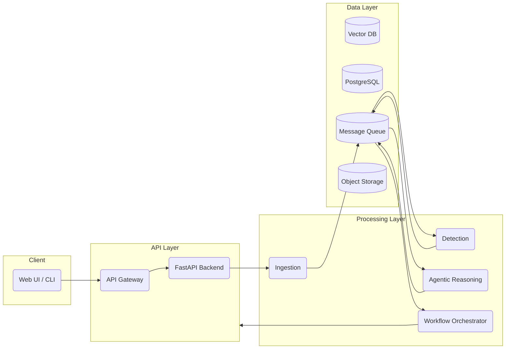

# 🔐 Secure Agentic CloudOps SIEM Platform


A cloud-native, event-driven **SIEM-style security and CloudOps platform** that demonstrates **log ingestion, streaming pipelines, detection engineering, and scalable backend system design**.

This project simulates how modern security platforms ingest logs, process them in real time, detect suspicious activity, and persist alerts for investigation — while also outlining a clear roadmap toward **agentic, LLM-powered security automation**.

---

## 📛 Badges

<p align="left">
  
  
  
</p>

> Badges reflect repository metadata only.  
> CI/CD, tests, SAST, secrets scanning, and docs badges will be enabled once workflows are implemented.

---

## 🎯 Project Objectives

- **Ingest logs:** Accept raw security logs through a REST API.
- **Stream events:** Stream logs using Kafka-compatible infrastructure (Redpanda).
- **Detect in real time:** Apply detection logic and scoring as events flow through the system.
- **Persist signals:** Store normalized events and alerts in PostgreSQL for investigation.
- **Support investigation:** Enable query-driven validation and basic investigation workflows.
- **Show system design:** Demonstrate production-grade, decoupled microservice architecture.
- **Enable a roadmap:** Provide a clear path to agentic security automation.

---

## 🚧 Implementation Status

This repository intentionally includes **both implemented components and a forward-looking architecture**.

### ✅ Implemented (fully working)

- Ingest service (FastAPI)
- Kafka-compatible streaming (Redpanda)
- Detection service consuming Kafka events
- PostgreSQL persistence for events and alerts
- End-to-end data flow validation
- One-command local execution (`scripts/run_all.sh`)
- Dockerized infrastructure

### 🧭 Planned / roadmap

- Agentic LLM reasoning engine
- Vector knowledge base for contextual retrieval
- Automated remediation workflows
- API gateway with authentication (JWT / OAuth / RBAC)
- SIEM dashboards and visualizations
- Cloud deployment (AWS / GCP)
- CI/CD pipelines (tests, SAST, secrets scanning)

> ⚠️ **Scope note**  
> Advanced components described later in this README represent **architectural intent and future roadmap**.  
> The current implementation focuses on a production-grade ingestion, streaming, detection, and persistence pipeline.

---

## 🧭 Table of Contents

- High-level architecture (current)
- Architecture explanation (step-by-step)
- Future-state architecture roadmap
- Technology stack
- Ports and services
- Repository structure
- Quick start (one command)
- Verify after running
- Stop and reset
- Service breakdown
- Developer experience (local development)
- CI/CD workflows (planned)
- Deployment (current and planned)
- Production hardening (planned)
- Observability (planned)
- Future enhancements
- License

---

## 🏗️ High-level architecture (current implementation)

```text
Client (curl / scripts / agents)
        |
        v
Ingest Service (FastAPI)
        |
        v
Kafka / Redpanda (topic: logs.raw)
        |
        v
Detection Service (Kafka Consumer)
        |
        v
PostgreSQL
   ├── events   (normalized logs)
   └── alerts   (scored detections)
```

---

## 🧠 Architecture explanation (step-by-step)

### 1️⃣ Client
- Represents VPN gateways, authentication servers, firewalls, cloud services, applications
- Sends logs as JSON payloads over HTTP

### 2️⃣ Ingest service (FastAPI)
- Validates incoming payloads
- Normalizes logs into a consistent event model
- Assigns a unique `event_id`
- Publishes events to Kafka topic `logs.raw`

**Why it matters**
- Decouples producers from consumers
- Enables independent scaling
- Kafka buffers spikes and protects downstream services

### 3️⃣ Kafka / Redpanda
- Event streaming backbone
- Reliable buffering and replay
- Fan-out to one or more consumers

### 4️⃣ Detection service
- Consumes from `logs.raw`
- Applies detection rules and scoring
- Writes alerts to PostgreSQL
- Optionally emits derived topics (`alerts.scored`)

### 5️⃣ PostgreSQL
- Stores normalized events and derived alerts
- Enables investigation and historical analysis

---

## 🧭 Future-state architecture roadmap (vision)



---

## 🔐 Technology stack

### Backend & streaming
- Python 3.12
- FastAPI
- Redpanda (Kafka-compatible)
- PostgreSQL

### Tooling & infrastructure
- Docker & Docker Compose
- Poetry
- VS Code

---

## 🔌 Ports and services

| Service | Port | Purpose |
|------|----:|------|
| Ingest Service | 8001 | Log ingestion API |
| Detection Service | 8002 | Detection + Kafka consumer |
| Redpanda (Kafka) | 9092 | Streaming broker |
| Redpanda Console | 8080 | Kafka UI |
| Redpanda HTTP API | 8082 | Broker admin |
| PostgreSQL | 5432 | Events & alerts DB |
| MLflow | 5001 | Experiment tracking |

---

## 📂 Repository structure

```text
secure-agentic-cloudops-siem-platform/
├── docker-compose.yml
├── README.md
├── LICENSE
├── .gitignore
├── services/
│   ├── ingest-service/
│   └── detection-service/
├── scripts/
│   ├── run_all.sh
│   ├── stop_all.sh
│   ├── reset_all.sh
│   └── seed_sample_events.py
└── docs/
```

---

## ⚡ Quick start (one command)

```bash
bash scripts/run_all.sh
```

This will:
- Start Docker infrastructure
- Create database tables
- Start ingest and detection services
- Send sample events
- Verify Kafka and PostgreSQL

---

## 🔎 Verify after running

```bash
curl http://127.0.0.1:8001/health
curl http://127.0.0.1:8002/health
```

```bash
docker exec -it secure-agentic-cloudops-siem-platform-postgres-1 \
psql -U app -d cloudops -c "SELECT COUNT(*) FROM alerts;"
```

---

## 🛑 Stop and reset

```bash
bash scripts/stop_all.sh
```

```bash
bash scripts/reset_all.sh
```

---

## 🧩 Service breakdown

> Sections below marked **(Planned)** describe future roadmap components.

<details>
<summary><strong>🧠 Agentic Reasoning Engine (Planned)</strong></summary>
LLM-powered reasoning, enrichment, and triage.
</details>

<details>
<summary><strong>⚙️ Workflow Orchestrator (Planned)</strong></summary>
Automated remediation workflows.
</details>

---

## 🧑‍💻 Developer experience (local development)

- Python virtual environments managed via Poetry
- Services run independently for local iteration
- Hot reload enabled via `uvicorn --reload`
- Docker used only for shared infrastructure

---

## 🔄 CI/CD workflows (planned)

- GitHub Actions
- Linting (Black, Ruff)
- Unit tests (pytest)
- Security scanning (SAST, secrets)
- Docker image builds

---

## 🚀 Deployment (current and planned)

### Current
- Local Docker Compose deployment

### Planned
- AWS (ECS / EKS)
- GCP (GKE)
- Terraform-based IaC

---

## 🔐 Production hardening (planned)

- TLS everywhere
- Secrets management
- Kafka partitioning
- Database indexing
- Rate limiting
- RBAC

---

## 📊 Observability (planned)

- Structured logging
- Prometheus metrics
- Grafana dashboards
- OpenTelemetry tracing

---

## 🚧 Future enhancements

- Agentic remediation
- Cross-event correlation
- Threat intelligence enrichment
- Multi-tenant support

---

## 📜 License

This project is licensed under the **MIT License**.
