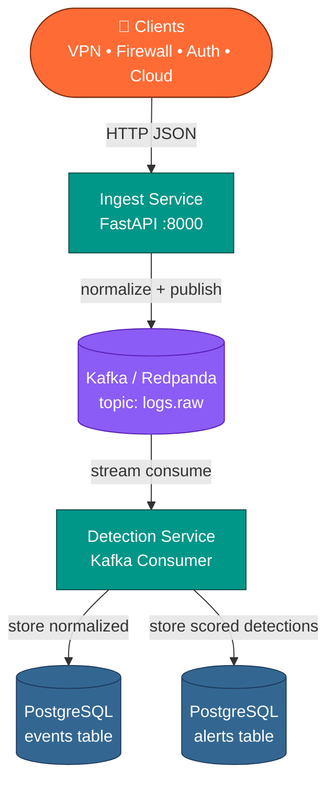
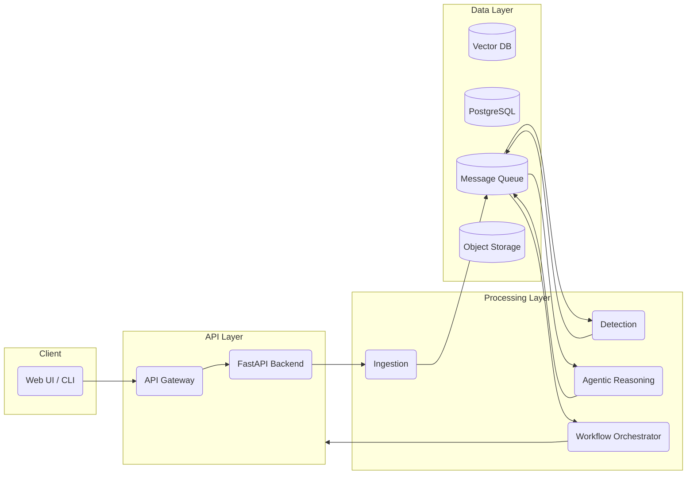

# 🔐 Secure Agentic CloudOps SIEM Platform

<p align="left">
  
  
  
  
  
  
  
  
  
  
  
  
</p>

A cloud-native, event-driven **SIEM-style security and CloudOps platform** that demonstrates **log ingestion, streaming pipelines, detection engineering, and scalable backend system design**.

This project simulates how modern security platforms ingest logs, process them in real time, detect suspicious activity, and persist alerts for investigation — while also outlining a clear roadmap toward **agentic, LLM-powered security automation**.

---

## 📡 Project Status

<table>
<tr>
<td>

### 🟢 Platform Status: **LIVE**

| Component | Status | Details |
|-----------|--------|---------|
| API Gateway | 🟢 Active | JWT auth + RBAC + rate limiting on `:8000` |
| Ingest Service | 🟢 Active | FastAPI on `:8001` — validates, normalizes, publishes to Kafka |
| Detection Engine | 🟢 Active | 5 rules, Kafka consumer, real-time scoring on `:8002` |
| SIEM Dashboard | 🟢 Active | Web UI with Chart.js visualizations on `:8003` |
| Agentic Engine | 🟢 Active | LLM-powered alert triage on `:8004` |
| Vector KB (RAG) | 🟢 Active | ChromaDB-backed semantic search on `:8005` |
| Remediation Workflows | 🟢 Active | Automated response engine on `:8006` |
| Streaming (Kafka) | 🟢 Active | Redpanda on `:9092` with Console UI on `:8080` |
| PostgreSQL | 🟢 Active | Events + alerts persistence on `:5432` |
| Prometheus | 🟢 Active | Metrics collection on `:9090` |
| Grafana | 🟢 Active | Dashboards on `:3000` (admin/admin) |
| CI/CD Pipeline | 🟢 Active | Lint → Test → SAST → Docker Build |
| MLflow | 🟢 Active | Experiment tracking on `:5001` |

</td>
</tr>
<tr>
<td>

### 📊 Pipeline Metrics

| Metric | Value |
|--------|-------|
| Microservices | 7 (gateway, ingest, detection, dashboard, agentic, vector-kb, remediation) |
| Detection Rules | 5 (severity, brute force, priv escalation, data exfil, suspicious network) |
| Remediation Workflows | 4 (block_ip, isolate_host, disable_user, escalate) |
| Unit Tests | 38+ across all services |
| Sample Events | 12 realistic security scenarios |
| Alert Labels | 7 categories |
| API Endpoints | 25+ across the platform |
| Docker Services | 13 (microservices + infra + observability) |

</td>
</tr>
</table>

> CI runs lint (Ruff + Black), unit tests (pytest), SAST (Bandit), secrets scanning, and Docker builds on every push and PR to `main`.

---

## 🎯 Project Objectives

- **Ingest logs:** Accept raw security logs through a REST API.
- **Stream events:** Stream logs using Kafka-compatible infrastructure (Redpanda).
- **Detect in real time:** Apply detection logic and scoring as events flow through the system.
- **Persist signals:** Store normalized events and alerts in PostgreSQL for investigation.
- **Support investigation:** Enable query-driven validation and basic investigation workflows.
- **Show system design:** Demonstrate production-grade, decoupled microservice architecture.
- **Enable a roadmap:** Provide a clear path to agentic security automation.

---

## 🚧 Implementation Status

This repository intentionally includes **both implemented components and a forward-looking architecture**.

### ✅ Implemented (fully working)

- **Ingest service** — FastAPI with validation and batch ingestion
- **Kafka streaming** — Redpanda for event streaming with replay
- **Detection engine** — 5-rule engine (brute force, privilege escalation, data exfiltration, suspicious network, severity)
- **PostgreSQL persistence** — Events and alerts with indexed queries
- **Investigation API** — Query alerts, events, stats, update alert status
- **API Gateway** — JWT authentication, RBAC (admin/analyst/viewer), rate limiting
- **SIEM Dashboard** — Web UI with severity charts, label distribution, recent alerts table
- **Agentic Reasoning Engine** — LLM-powered triage with rule-based fallback (no API key required)
- **Vector Knowledge Base** — ChromaDB-backed semantic search for alerts and threat intel
- **Remediation Workflows** — 4 automated workflows (block_ip, isolate_host, disable_user, escalate)
- **Observability** — Prometheus metrics + Grafana dashboards
- **One-command execution** — `scripts/run_all.sh`
- **Fully Dockerized** — 13 services with health checks and proper dependencies
- **CI/CD pipeline** — Ruff + Black, pytest, Bandit SAST, secrets scanning, Docker builds

### 🧭 Planned / roadmap

- Cloud deployment (AWS ECS/EKS, GCP GKE) with Terraform IaC
- TLS everywhere, secrets management (Vault)
- Multi-tenant support
- Cross-event correlation engine
- Threat intelligence feed integration

---

## 🧭 Table of Contents

- High-level architecture (current)
- Architecture explanation (step-by-step)
- Future-state architecture roadmap
- Technology stack
- Ports and services
- Repository structure
- Quick start (one command)
- Verify after running
- Stop and reset
- Service breakdown
- Developer experience (local development)
- CI/CD workflows (planned)
- Deployment (current and planned)
- Production hardening (planned)
- Observability (planned)
- Future enhancements
- License

---

## 🏗️ High-level architecture (current implementation)


```mermaid
flowchart TD
    Client([📡 Clients<br/>VPN • Firewall • Auth • Cloud])
    Ingest[Ingest Service<br/>FastAPI :8000]
    Kafka[(Kafka / Redpanda<br/>topic: logs.raw)]
    Detect[Detection Service<br/>Kafka Consumer]
    Events[(PostgreSQL<br/>events table)]
    Alerts[(PostgreSQL<br/>alerts table)]

    Client -->|HTTP JSON| Ingest
    Ingest -->|normalize + publish| Kafka
    Kafka -->|stream consume| Detect
    Detect -->|store normalized| Events
    Detect -->|store scored detections| Alerts

    classDef client fill:#FF6B35,stroke:#7c2d12,color:#fff
    classDef svc fill:#009688,stroke:#0d4f47,color:#fff
    classDef bus fill:#8b5cf6,stroke:#5b21b6,color:#fff
    classDef store fill:#336791,stroke:#1e3a5f,color:#fff
    class Client client
    class Ingest,Detect svc
    class Kafka bus
    class Events,Alerts store
```

<details>
<summary><b>📝 ASCII fallback (in case Mermaid doesn't render)</b></summary>

```text
                        ┌──────────────────────┐
                        │   API Gateway (8000) │
                        │  JWT + RBAC + Rate   │
                        └──────────┬───────────┘
                                   │
              ┌────────────────────┼────────────────────┐
              v                    v                    v
    ┌──────────────────┐  ┌──────────────────┐  ┌──────────────────┐
    │ Ingest (8001)    │  │ Dashboard (8003) │  │ Remediation(8006)│
    │   FastAPI        │  │   Web UI         │  │   Workflows      │
    └─────────┬────────┘  └────────┬─────────┘  └──────────────────┘
              │                    │
              v                    │
    ┌──────────────────┐           │
    │ Kafka / Redpanda │           │
    │   (logs.raw)     │           │
    └─────────┬────────┘           │
              v                    │
    ┌──────────────────┐           │
    │ Detection (8002) │<──────────┘
    │  5-rule engine   │
    └─────────┬────────┘
              │
              v
    ┌──────────────────┐  ┌──────────────────┐  ┌──────────────────┐
    │   PostgreSQL     │  │ Agentic (8004)   │  │ Vector KB (8005) │
    │ events + alerts  │<-│ LLM Triage       │->│ ChromaDB / RAG   │
    └──────────────────┘  └──────────────────┘  └──────────────────┘

    ┌──────────────────┐  ┌──────────────────┐
    │ Prometheus (9090)│->│  Grafana (3000)  │   ← Observability
    └──────────────────┘  └──────────────────┘
```

</details>

---

## 🧠 Architecture explanation (step-by-step)

### 1️⃣ Client
- Represents VPN gateways, authentication servers, firewalls, cloud services, applications
- Sends logs as JSON payloads over HTTP

### 2️⃣ Ingest service (FastAPI)
- Validates incoming payloads
- Normalizes logs into a consistent event model
- Assigns a unique `event_id`
- Publishes events to Kafka topic `logs.raw`

**Why it matters**
- Decouples producers from consumers
- Enables independent scaling
- Kafka buffers spikes and protects downstream services

### 3️⃣ Kafka / Redpanda
- Event streaming backbone
- Reliable buffering and replay
- Fan-out to one or more consumers

### 4️⃣ Detection service
- Consumes from `logs.raw`
- Applies detection rules and scoring
- Writes alerts to PostgreSQL
- Optionally emits derived topics (`alerts.scored`)

### 5️⃣ PostgreSQL
- Stores normalized events and derived alerts
- Enables investigation and historical analysis

---

## 🧭 Future-state architecture roadmap (vision)


```mermaid
flowchart LR
  subgraph Client
    UI(Web UI / CLI)
  end
  subgraph API["API Layer"]
    GW(API Gateway)
    BE(FastAPI Backend)
  end
  subgraph Data["Data Layer"]
    VDB[(Vector DB)]
    DB[(PostgreSQL)]
    MQ[(Message Queue)]
    OBJ[(Object Storage)]
  end
  subgraph Processing["Processing Layer"]
    ING(Ingestion)
    DET(Detection)
    AG(Agentic Reasoning)
    WF(Workflow Orchestrator)
  end
  UI --> GW --> BE
  BE --> ING --> MQ
  MQ --> DET --> MQ
  MQ --> AG --> MQ
  MQ --> WF --> API
```

---

## 🔐 Technology stack

### Backend & streaming
- Python 3.12
- FastAPI
- Redpanda (Kafka-compatible)
- PostgreSQL

### Tooling & infrastructure
- Docker & Docker Compose
- Poetry
- VS Code

---

## 🔌 Ports and services

| Service | Port | Purpose |
|------|----:|------|
| API Gateway | 8000 | Auth + RBAC + rate limiting |
| Ingest Service | 8001 | Log ingestion API |
| Detection Service | 8002 | Detection + Kafka consumer |
| Dashboard Service | 8003 | SIEM web dashboard |
| Agentic Engine | 8004 | LLM-powered alert triage |
| Vector KB | 8005 | RAG semantic search |
| Remediation Service | 8006 | Automated workflows |
| Redpanda (Kafka) | 9092 | Streaming broker |
| Redpanda Console | 8080 | Kafka UI |
| Redpanda HTTP API | 8082 | Broker admin |
| PostgreSQL | 5432 | Events & alerts DB |
| Prometheus | 9090 | Metrics collection |
| Grafana | 3000 | Observability dashboards |
| MLflow | 5001 | Experiment tracking |

---

## 📂 Repository structure

```text
secure-agentic-cloudops-siem-platform/
├── docker-compose.yml
├── README.md
├── LICENSE
├── .gitignore
├── pyproject.toml
├── .github/workflows/
│   └── python-app.yml          # CI/CD pipeline
├── services/
│   ├── ingest-service/
│   │   ├── Dockerfile
│   │   ├── pyproject.toml
│   │   ├── app/
│   │   │   └── main.py         # FastAPI ingest endpoints
│   │   └── tests/
│   │       └── test_ingest.py
│   └── detection-service/
│       ├── Dockerfile
│       ├── pyproject.toml
│       ├── app/
│       │   ├── main.py          # FastAPI detection + query endpoints
│       │   └── rules.py         # Detection rules engine
│       └── tests/
│           └── test_rules.py
├── scripts/
│   ├── run_all.sh               # One-command startup
│   ├── stop_all.sh              # Graceful shutdown
│   ├── reset_all.sh             # Full reset (volumes + images)
│   ├── init_db.sql              # PostgreSQL schema
│   └── seed_sample_events.py    # Sample security events
└── docs/
```

---

## ⚡ Quick start (one command)

```bash
bash scripts/run_all.sh
```

This will:
- Start Docker infrastructure
- Create database tables
- Start ingest and detection services
- Send sample events
- Verify Kafka and PostgreSQL

---

## 🔎 Verify after running

```bash
curl http://127.0.0.1:8001/health
curl http://127.0.0.1:8002/health
```

```bash
docker exec -it secure-agentic-cloudops-siem-platform-postgres-1 \
psql -U app -d cloudops -c "SELECT COUNT(*) FROM alerts;"
```

---

## 🛑 Stop and reset

```bash
bash scripts/stop_all.sh
```

```bash
bash scripts/reset_all.sh
```

---

## 🧩 Service breakdown

> Sections below marked **(Planned)** describe future roadmap components.

<details>
<summary><strong>🧠 Agentic Reasoning Engine (Planned)</strong></summary>
LLM-powered reasoning, enrichment, and triage.
</details>

<details>
<summary><strong>⚙️ Workflow Orchestrator (Planned)</strong></summary>
Automated remediation workflows.
</details>

---

## 🧑‍💻 Developer experience (local development)

- Python virtual environments managed via Poetry
- Services run independently for local iteration
- Hot reload enabled via `uvicorn --reload`
- Docker used only for shared infrastructure

---

## 🔄 CI/CD workflows

Implemented via GitHub Actions (`.github/workflows/python-app.yml`):

- **Lint** — Ruff and Black format checks
- **Test** — pytest suites for ingest-service and detection-service (run in parallel)
- **Security** — Bandit SAST scan + grep-based secrets detection
- **Docker build** — Validates both service images build successfully

---

## 🚀 Deployment (current and planned)

### Current
- Local Docker Compose deployment

### Planned
- AWS (ECS / EKS)
- GCP (GKE)
- Terraform-based IaC

---

## 🔐 Production hardening (planned)

- TLS everywhere
- Secrets management
- Kafka partitioning
- Database indexing
- Rate limiting
- RBAC

---

## 📊 Observability (planned)

- Structured logging
- Prometheus metrics
- Grafana dashboards
- OpenTelemetry tracing

---

## 🚧 Future enhancements

- Agentic remediation
- Cross-event correlation
- Threat intelligence enrichment
- Multi-tenant support

---

## 📜 License

This project is licensed under the **MIT License**.
