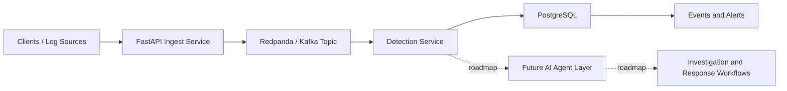

# Secure Agentic CloudOps SIEM Platform


Secure Agentic CloudOps SIEM Platform is a cloud-native, event-driven security platform that demonstrates how logs can be ingested, streamed, detected, and persisted through a decoupled microservice architecture. It is designed as a credible SIEM-style backend with a forward path toward AI-assisted triage, retrieval, and agentic security workflows.

## Overview

This repository focuses on the system design layer behind modern security analytics platforms. The current implementation provides working ingestion, Kafka-compatible event streaming through Redpanda, a detection service, and PostgreSQL-backed alert persistence.

The project intentionally separates what is already implemented from what is planned next. Today it demonstrates a practical event pipeline. Longer term it serves as a foundation for AI agents, contextual retrieval, and automated response workflows in a secure CloudOps or SIEM environment.

## Architecture Diagram


```mermaid
flowchart LR
    producer["Clients / Log Sources"] --> ingest["FastAPI Ingest Service"]
    ingest --> stream["Redpanda / Kafka Topic"]
    stream --> detect["Detection Service"]
    detect --> db["PostgreSQL"]
    db --> alerts["Events and Alerts"]
    detect -. roadmap .-> agent["Future AI Agent Layer"]
    agent -. roadmap .-> actions["Investigation and Response Workflows"]
```

## Features

- Event-driven architecture for ingesting and processing security events
- FastAPI ingestion service for accepting normalized log payloads
- Redpanda or Kafka-compatible event backbone for decoupled processing
- Detection engine that consumes events and produces scored alerts
- PostgreSQL persistence for normalized events and detection results
- Dockerized local environment for end-to-end testing and demos
- Clear separation between implemented platform components and future AI agent roadmap
- Cloud-native SIEM design that can evolve into contextual triage and remediation workflows

## Tech Stack

| Layer | Technologies |
| --- | --- |
| API and services | FastAPI, Python 3.12 |
| Streaming | Redpanda, Kafka-compatible messaging |
| Persistence | PostgreSQL |
| Infra and packaging | Docker, Docker Compose, Poetry |
| Design direction | Detection engineering, event-driven systems, future AI agent integration |

## Project Structure

```text
secure-agentic-cloudops-siem-platform/
|-- docker-compose.yml
|-- README.md
|-- pyproject.toml
|-- services/
|   |-- ingest-service/
|   |   |-- app/
|   |   |   `-- main.py
|   |   |-- pyproject.toml
|   |   `-- README.md
|   `-- detection-service/
|       |-- app/
|       |   `-- main.py
|       |-- pyproject.toml
|       `-- README.md
|-- scripts/
|   |-- run_all.sh
|   |-- stop_all.sh
|   |-- reset_all.sh
|   `-- seed_sample_events.py
`-- docs/
```

## Installation

### Prerequisites

- Docker Desktop or a compatible Docker runtime
- Python 3.12 if you want to run services outside containers

### Setup

```bash
git clone https://github.com/virinchisai/secure-agentic-cloudops-siem-platform.git
cd secure-agentic-cloudops-siem-platform
```

## Quick Start

Run the full platform locally:

```bash
bash scripts/run_all.sh
```

This starts:

- Ingest service on `http://127.0.0.1:8001`
- Detection service on `http://127.0.0.1:8002`
- Redpanda broker and console
- PostgreSQL for event and alert persistence

Verify the services:

```bash
curl http://127.0.0.1:8001/health
curl http://127.0.0.1:8002/health
```

Check persisted alerts:

```bash
docker exec -it secure-agentic-cloudops-siem-platform-postgres-1 \
psql -U app -d cloudops -c "SELECT COUNT(*) FROM alerts;"
```

Stop the environment:

```bash
bash scripts/stop_all.sh
```

Reset containers and local state:

```bash
bash scripts/reset_all.sh
```

## Screenshots

Screenshots can be added here to show:

- Event ingestion requests
- Redpanda console topics and throughput
- Detection results in PostgreSQL
- Future dashboard or investigation UI

Placeholder:

```text
docs/screenshots/
|-- ingest-api.png
|-- redpanda-console.png
|-- alerts-table.png
`-- dashboard.png
```

## Future Roadmap

- AI agent layer for triage, correlation, and investigation support
- Retrieval-backed context for alerts and prior incident knowledge
- Automated remediation workflows and response orchestration
- Authentication and authorization with JWT, OAuth, or RBAC
- Observability with Prometheus, Grafana, and structured tracing
- Cloud deployment on AWS or GCP with production-grade hardening
- CI/CD workflows for testing, linting, image builds, and security scanning
- Multi-tenant platform controls and stronger retention policies

## Design Notes

- The current implementation intentionally emphasizes a strong backbone first: ingestion, streaming, detection, and persistence.
- AI agent integration is part of the roadmap, not a completed feature today.
- The repository is positioned as a platform foundation for secure, AI-assisted operations rather than a finished enterprise SIEM product.

## License

This project is licensed under the [MIT License](LICENSE).
